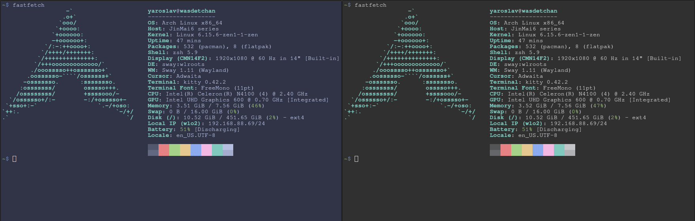

# Colorscheme transformer
- Fill templates with colorsets
- Make templates from colorschemes
- Transform colorschemes to different colorsets

## How to use
### Installation
```console
cargo install colorscheme-transformer
```
### Format
Colorset is YAML file in format:  
NAME: RRGGBB  
RRGGBB case is ignored.  
Colorscheme is a program-specific ready-to-use file.  
Template is a colorscheme where some colors RRGGBB changed to their name {NAME} to be filled with a colorset.  
### Args
Input file (template or colorscheme) can be set using --input (or -i) argument, or read from stdin if not set.  
Output file (template or colorscheme) can be set using --output (or -o) argument, or written to stdout if not set.  
### Make template
```console
coroscheme-transformer make -i [colorscheme] -o [output] [colorset]
```
Makes template from colorscheme and colorset.
For each color RRGGBB with name NAME in colorset changes every RRGGBB occurence in colorscheme to {NAME} and prints to stdout. Ingores RRGGBB case.
### Fill template
```console
coroscheme-transformer fill -i [template] -o [output] [colorset]
```
Substitutes {NAME}s in template to their corresponding colors from colorsets and prints to stdout. Case-sensitive, NAMEs not present in colorset are ignored.
### Transform colorscheme

```console
coroscheme-transformer transform -i [colorscheme] -o [output] [colorset_from] [colorset_to]
```
Same as first making template with the first colorset and then filling it with the second colorset.
### Example
In project's root directory:
```console
touch example/kitty-gray.conf
cat example/kitty.conf | colorscheme-transformer transform example/catppuccin-frappe.yaml example/catppuccin-frappe-gray.yaml > example/kitty-gray.conf
```
Or (equivalent)
```console
coloscheme-transformer transform example/catppuccin-frappe.yaml example/catppuccin-frappe-gray.yaml --input=example/kitty.conf -o example/kitty-gray.conf
```

example/kitty.conf - catppuccin-frappe colorscheme for kitty  
example/catppuccin-frappe.yaml - catppuccin-frappe colorset  
example/catppuccin-frappe-gray.yaml - colorset based on catppuccin-frappe with gray backgrounds  
produces  
example/kitty-gray.conf - catppuccin-frappe colorscheme for kitty with gray backgrounds  
Normal/Gray:  

